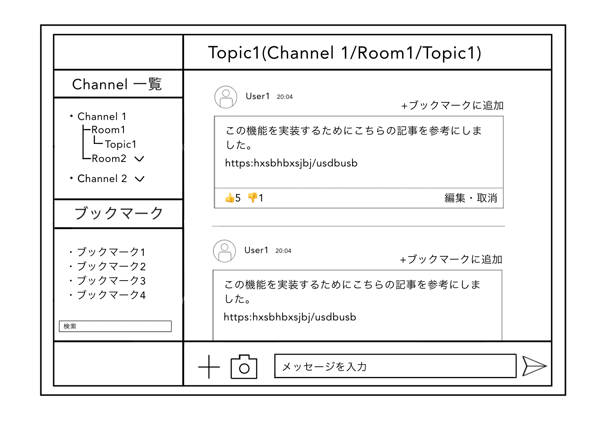

# HR クラウド 内定者インターン課題

### 9/18 の成果

- ユーザー招待とメンションの通知機能
- views修正
- 今いるチャンネルをハイライト
- 自分のメッセージをハイライト
- 招待時にメッセージを残す
- チャンネルにいるユーザー一覧を表示(オーナーを明示)
- モーダルまわり
- チャンネルのフィルター

### よく使うファイルのリンク

[チャット画面(views/message/index.php)](/fuel/app/views/message/index.php)

[チャット保存(controller/chat.php)](/fuel/app/classes/controller/chat.php)

[チャンネル一覧画面(views/channel/channel.php)](/fuel/app/views/channel/channel.php)

[チャンネル追加(controller/channel.php)](fuel/app/classes/controller/channel.php)

 

## <課題　開発編要件>

- サーバサイド言語/フレームワークに PHP/Fuelphp を使用
- CRUD の機能が網羅されている
- フロントエンドのライブラリに knockout.js が使用されている
- ux を考慮して一部動的な ui が実装されている
- 採用一括かんりくんで使用されている stylesheet テンプレートを使用する

 

## <開発環境>

- MAMP
- PHP 8.0.1, 7.3
- fuelphp 1.8
- knockout.js 3.5.0
- ajax 3.4.1

 

## <要件定義>

### 開発概要

- チャットアプリ
- 単なるコミュニケーションツールではなく、ナレッジマネジメントに特化させる
- ここでいうナレッジマネジメントは、ナレッジ(メッセージ)の共有と管理を指す
- 例えば、開発時のプロジェクトに関する情報や参考文献、エラー等に対する対処法等を記録
- イメージとしては GitHub+Slack(+wiki+qiita)

### 開発要件

- Slack のような機能を備えたチャットアプリを目指す過程で、メッセージの既読未読や鍵付きチャンネルへの招待など、細かな要素にこだわった開発にしたい。

### 機能要件

- チャット機能
- good/bad 等のリアクション
- ブックマーク(メッセージを保存し、見たいときにアクセスできる)
- メッセージの編集と送信取り消し
- メンション機能とその通知
- 既読未読の判別
- メッセージのフィルター検索
- 簡単なスレッド機能
- ユーザー 1 人用のプライベートチャンネル
- チャンネルに鍵をかける
- 鍵付きチャンネルへユーザーを招待
- プロフィールページ

### 開発スケジュール

- 8/23(火)から本格的に開発スタート
- 9 月 20 ごろ完成を予定

<!-- ### UI イメージ

※メッセージについては最低限テキストの送信だけでも実装 -->

## <チェックシート>

### [チェックシート](/main/check_sheet.md)

<!-- #### 構成

- チャンネル一覧

  → ディレクトリのような見た目

- ブックマーク

  → すぐにアクセスしたいメッセージにタイトルをつけてブックマーク

  → タイトルで検索可能

- トークページ

  → メッセージ一覧と 👍👎 とブックマーク、メッセージ編集

### 補足

- -->

 

## <DB の設計>

### [データベース設計](https://docs.google.com/spreadsheets/d/1eardZKwNqOiGUFWTd6UJJSQfEZRKDcCcSSX4yI41e7E/edit?usp=sharing)
